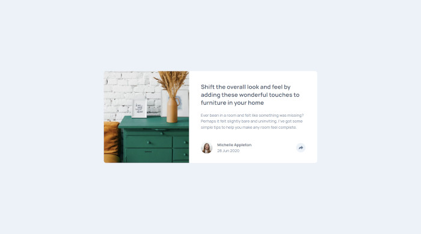
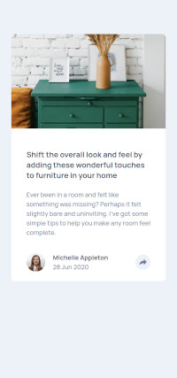

# Frontend Mentor - Article preview component solution

This is a solution to the [Article preview component challenge on Frontend Mentor](https://www.frontendmentor.io/challenges/article-preview-component-dYBN_pYFT). Frontend Mentor challenges help you improve your coding skills by building realistic projects.

## Table of contents

- [Overview](#overview)
  - [The challenge](#the-challenge)
  - [Screenshot](#screenshot)
  - [Links](#links)
- [My process](#my-process)
  - [Built with](#built-with)
  - [Useful resources](#useful-resources)
- [Author](#author)

## Overview

### The challenge

Users should be able to:

- View the optimal layout for the component depending on their device's screen size
- See the social media share links when they click the share icon

### Screenshot

### Links

- Solution URL: [Solution](https://github.com/unkovicgit/article-preview-component)
- Live Site URL: [Live Site](https://unkovicgit.github.io/article-preview-component/)

## My process

### Built with

- Semantic HTML5 markup
- CSS custom properties
- Flexbox
- CSS Grid
- Mobile-first workflow

### Useful resources

- [CSS-Tricks](https://css-tricks.com/)
- [MDN Web Docs](https://developer.mozilla.org/en-US/)

## Author

- Website - [Unković Nemanja](https://github.com/unkovicgit/)
- Frontend Mentor - [@unkovicgit](https://www.frontendmentor.io/profile/unkovicgit)
- Twitter - [@nemanja_unkovic](https://twitter.com/nemanja_unkovic)
